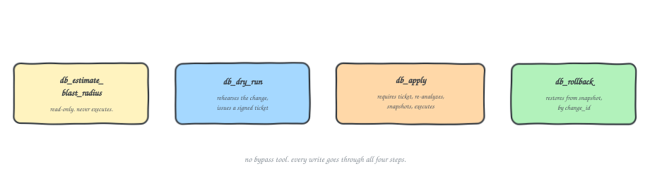

Every DB DevOps person already has a version of this story sitting somewhere in their head. This is mine, and it's the reason blastshield exists.

## Problem

I kept running into the same failure mode with MCP servers that touch a database: give an agent a `run_query` or `execute` tool, and eventually it calls that tool with the wrong statement, calls it twice because the first response timed out, or runs something on prod it only meant to test against staging. It's the "ran fine in staging, took prod down at 2am" migration, except the thing that ran it is an agent with a retry loop built into how it calls tools, and no sense of consequence.

Most MCP content stops at "wire up a tool that runs SQL." That's fine for a demo, and it falls apart the moment the tool has write access and the caller is non-deterministic. I needed a pattern that held up against the real constraints: an agent that retries, a schema that can change between one call and the next, and no guarantee the caller remembers what it already tried. That's what became **blastshield**: an MCP server for Postgres and MongoDB where every write goes through the same lifecycle, and there is no tool that bypasses it.

## How it works

**Tool design: the ticket is the actual boundary, not a convention.** Rather than one `execute` tool, there are four, chained by a signed artifact instead of an instruction the model is expected to follow:

- `db_estimate_blast_radius`: returns what will be touched, estimated rows, and the policy verdict, without touching anything.
- `db_dry_run`: rehearses the change for real (below) and issues a ticket.
- `db_apply`: requires that ticket, re-analyzes the change against current policy, snapshots, then executes.
- `db_rollback`: restores from the snapshot by `change_id`.

The ticket is HMAC-signed and bound to the SHA-256 hash of the exact change. Dry-run one statement, try to apply a different one, and verification fails. Tickets expire (600s default) and are single-use. Call apply twice and the second call is refused, not re-executed. None of this depends on the agent behaving correctly; it makes misbehaving structurally unavailable at the tool boundary.

**Context management: structured operations, not strings.** Mongo changes go in as a typed JSON operation (collection, operation, filter, update), not a shell string the agent has to construct exactly right. A smaller, typed surface gives the model less room to build something ambiguous, and gives the server something concrete to validate before anything runs. Postgres gets the same treatment: the server parses and analyzes the statement itself rather than trusting a description of it.

**Dry run as a real eval step, not a mock.** On Postgres, dry run actually executes inside a transaction that then rolls back, so you get real row counts, not estimates, even for DDL like `CREATE TABLE` or `ALTER`. Operations that can't run inside a transaction block fall back to a `simulated` mode that validates and estimates, and says so. MongoDB does the equivalent with a session transaction that aborts, or `simulated` on a standalone server with no abortable writes. This is functionally an eval pipeline for the one change an agent is about to make: rehearse it for real, check it against policy, then let it write.

**Policy is deny-by-default.** Unfiltered UPDATE/DELETE, TRUNCATE, `DROP DATABASE`, multi-statement SQL, and changes with no rollback path are all denied unless explicitly turned on via env var. `DROP DATABASE` and Mongo's `drop_collection`/`drop_database` aren't overridable; they're not exposed at all. Postgres analysis runs on a pool forced to `default_transaction_read_only=on`, so a bug in the analysis code can't write by accident. Every dry run, apply, rollback, and refusal lands in a hash-chained audit log that's tamper-evident, not tamper-proof, and it says so instead of overselling it.

Rollback is snapshot-based: matched rows or generated IDs are captured before apply and restored by primary key or `_id` on rollback. No primary key means no automatic undo, and the server tells you that instead of pretending it has one.

## Why this helps others (and me)

For anyone building MCP tools that touch state instead of just reading it, the transferable piece isn't "add a dry run." It's that the safety boundary has to be a structurally enforced artifact, not a rule the model is expected to follow. I ran into the same shape of problem building the GKE ephemeral access broker: the fix wasn't better prompting, it was making the unsafe path physically unavailable. TTL and ownerReference cascade there, a signed, content-bound, single-use ticket here. Enterprise MCP content mostly stops at tool listings and auth setup; what actually breaks in production is what happens when the caller is non-deterministic and gets to retry.

For me, it's a reusable pattern for the next tool-design problem: separate the read path from the write path, gate the write path with an artifact bound to the exact action rather than a description of it, and make the dry run perform real verification instead of returning a guess. That's directly reusable for the next database or infra tool I wire an agent up to, and it's the piece most MCP writeups skip, because it only shows up once an agent has actually misused a tool against a real system.

[**blastshield**](https://github.com/Sonichigo/blastshield) is Apache-2.0, works with Postgres and MongoDB today, and the honest limitation worth repeating: it's a safety layer, not an authz layer. It constrains what a change looks like, not who's allowed to ask for it. Run it against a least-privilege role. Don't hand it a superuser.

## Conclusion

With fast moving schema changes and non-deterministic agents, it's easy to accidentally make a change that breaks production. Blastshield provides a structured lifecycle for database writes, ensuring that every change is evaluated, rehearsed, and verified before being applied. By enforcing a deny-by-default policy and requiring signed tickets for changes, blastshield minimizes the risk of accidental or malicious modifications to the database. The snapshot based rollback mechanism further enhances safety by allowing for easy restoration of the previous state if needed. Overall, blastshield offers a robust solution for managing database changes in a safe and auditable manner.

## FAQs

### How does blastshield handle schema changes that are not backward compatible?
Blastshield enforces a strict policy for schema changes. It requires that any schema change be evaluated through the `db_estimate_blast_radius` and `db_dry_run` tools before being applied. If a schema change is not backward compatible, it will be denied unless explicitly allowed through the policy configuration. This ensures that any potentially disruptive changes are carefully reviewed and tested before being executed in production.

### What happens if a dry run fails?
If a dry run fails, the server will return an error indicating the reason for the failure. The change will not be issued a ticket, and the agent will not be able to proceed with the `db_apply` tool. The agent must address the issues identified during the dry run before attempting to apply the change again. This prevents any unsafe or unverified changes from being executed in the database.

### How does the rollback mechanism work?
The rollback mechanism in blastshield is snapshot-based. Before applying a change, the server captures the current state of the affected rows or documents. If a rollback is requested, the server uses this snapshot to restore the database to its previous state. The rollback is performed using primary keys for Postgres or `_id` for MongoDB. If the affected data does not have a primary key or unique identifier, the server will inform the agent that automatic rollback is not possible for that change.

## References
- https://www.harness.io/blog/zero-downtime-database-migrations-safe-schema-changes
- https://github.com/Sonichigo/blastshield